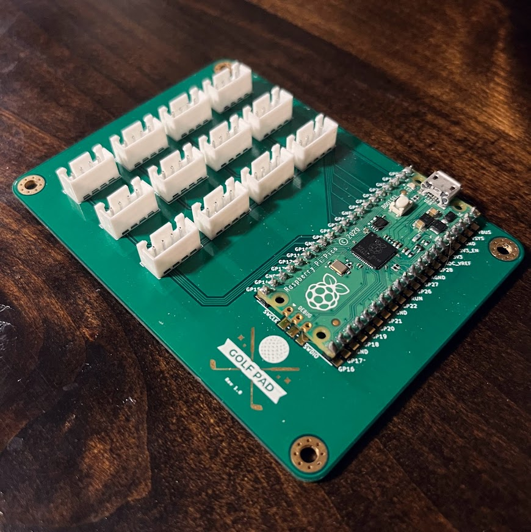

# Golf Pad

A simple macro pad to use with your golf launch monitor setup.

## Required Hardware

  - 1 x PCB (I printed mine from JLCPCB.com)
  - 12 x [Arcade Buttons](https://www.amazon.com/gp/product/B07XYVP62V/ref=ppx_yo_dt_b_asin_title_o05_s00?ie=UTF8&psc=1) Any 4 Pin style Arcade button will work, I opted for the 60mm variety
  - 1 x [Raspberry Pi Pico](https://www.adafruit.com/product/4883)
  - 12 x [JST-XH connectors](https://www.amazon.com/gp/product/B0791DJMW9/ref=ppx_yo_dt_b_asin_title_o03_s00?ie=UTF8&psc=1)

## Software

To program the macro pad simply edit the `code.py` file to have the keybindings you want. Then all you need to do is drag and drop the code.py file and `lib` directory onto the root of your Raspberry Pi Pico.

